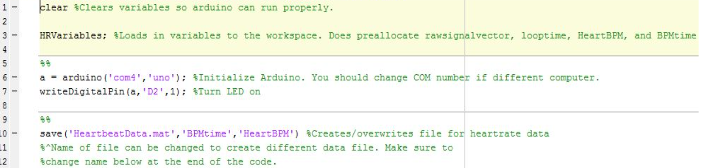

# Heart-Rate-Monitor
A MATLAB project to create a heart rate monitor using an LED and an Arduino

Click for the Youtube Video

Our heart rate code consists of four made-functions and two scripts including the main script. The script called HRVariables (see image below) contains values that will be called in the the script HRMonitor, the main script. We like to keep values of variables in a separate script for convenience such as quick manipulation of the variables and keeping the main script from being too lengthy.

The first part of HRMonitor is making preparations before acquiring data from the hardware device. First the main script clears the workspace to prevent any previously established variables from interfering with the script. Next, it calls the HRVariables script to obtain the values. Then the main script calls for the arduino and turns on the red LED using ‘writeDigitalPin’ (see image below). Then HRMonitor makes a file for the heart rate data (overriding is possible).

The duration for running HRMonitor depends on the ‘Maxcounter’, a variable from HRVariables. ‘Maxcounter’ dictates how many times we will process a raw signal into a heart rate reading (this process is encompassed by a ‘for’ loop going from 1 to ‘Maxcounter’). The first command in this large ‘for’ loop is to set a variable equal to ‘clock’ (a function) to start timing the signal acquisition. The script uses ‘readVoltage’ to obtain a value (from what the hardware read) and place it in a vector called ‘rawsignalvector’. The length of ‘rawsignalvector’ is the value for ‘samplesize’, a variable from the HRVariables script. Another vector is created to record the time it takes to acquire the signal with indices defined by ‘samplesize’ (see image below). 

HRMonitor calls one of our  made-function, signaltime (see image below) which uses variables ‘timezero’, ‘signalsize’, and ‘looptime’ to find the timestep (dt), sampling frequency (f_s), the last value of the time vector (‘timeend’), and a vector going from ‘timezero’ to ‘timeend’ in steps of dt (timevector). 

The figure below is a plot of the values from ‘rawsignalvector’ in relation to the values from ‘timevector.’

The next part of HRmonitor is to call another one of our made-function called BestCurveFit (see image below). BestCurveFit uses variables ‘maxdegree’, ‘signalsizevector’, and ‘rawsignalvector’ to create a curve that best fits the raw signal. The function ‘polyfit’ requires the degree number as an input but we do not know which degree number works best for the curve so we used a ‘for’ loop for each degree from 1 to ‘maxdegree’ (a variable from HRVariables). 

The output variables of the ‘polyfit’ function is ‘p’, ‘S’, and ‘mu’ (‘p’ is a vector containing coeffecients for curve of some degree that best fits ‘rawsignalvector’, ‘S’ is the structure used as input to polyval to obtain error estimates if necessary, and  ‘mu’ is a two element vector with centering and scaling values for ‘rawsignalvector’). Then we input those three variables and ‘signalsizevector’ (a vector of values from 1 to ‘signalsize’) in the ‘polyval’ function to calculate a vector, ‘curvefit{1,*degree number*}.’ This vector contains values that make up the fitting curve. Then we calculate the sum of squares (squaring the difference of each value in ‘rawsignalvector’ from the corresponding values from the “curvefit” vector and then adding up the results). The smaller the sum of squares, the better fit the curve is which is why we use the ‘min’ function to find that smallest value and trace it to the degree number. BestCurveFit outputs ‘curvefit’ (the cell array that contains “curvefit” vectors for each degree) and ‘curvefitindex’ the degree number or index of the polynomial.

Subtracting ‘rawsignalvector’ from ‘curvefit{1,curvefitindex}’ (vector of the best curvefit) results in a vector of the detrended signal, ‘detrendsignal’ (see image below). The figure below the image is a plot of the values from ‘detrendsignal’ in relation to the values from ‘timevector.’

The next part of HRMonitor is to create a fast fourier transform (fft) of the detrended signal using another one of our made-functions, ‘timetofreqdomain.’ To calculate the desired fft vector (‘fftvector’), we took the absolute value of the fft of ‘detrendsignal’ (there are complex numbers in ‘fft(detrendsignal)’) and shifted the vector so that frequency=0 is centered. By using ‘timevector’ and the length of ‘fftvector’ we can calculate the time step ‘dt.’ From there, sampling frequency and nyquist frequency is calculated. Then the frequency vector is created. Below are the images of ‘timetofreqdomain.’ The output variables of ‘timetofreqdomain’ is the detrended fft vector and its frequency vector (‘detrendfftvector’ and ‘detrendfreqvector’).

The figure below is a plot of the values from ‘detrendfftvector’ in relation to the values from ‘detrendfreqvector.’

The next part of HRMonitor is filtering the detrended signal using a band pass filter, in the form of the function, BandPassHR, first made using sptool and imported as MATLAB code.  In BandPassHR we set values for the 4 passband frequencies (this filter is a bandpass filter which only accepts a certain range of frequencies): the first stopband frequency (‘Fstop1’), first passband frequency (‘Fpass1’), the second stopband frequency (‘Fstop2’), and the second passband frequency (‘Fpass2’). The filter range is from ‘Fpass1’ and ‘Fstop2.’ The other variables needed to create the band pass filter was the sampling frequency, which we set to 40 Hz. The output of BandPassHR is the variable ‘BandPass’ (the variable ‘Hd’ in BandPassHR).

After calling BandPassHR, we use the ‘filter’ function with ‘BandPass’ and ‘detrendsignal’ to calculate the filtered signal vector (‘filteredsignal’). The figure below is a plot of the values from ‘filteredsignal’ in relation to the values from ‘timevector.’

The next part of HRMonitor is calling timeoffreqdomain to calculate outputs ‘filterfftvector’ and ’filterfreqvector’ (filtered fft vector and filtered frequency vector respectively). The figure below is a plot of the values from ‘filterfftvector’ in relation to the values from ‘filterfreqvector.’

By using the ‘max’ function we found the amplitude (‘MaxFFTAmp’) and the index location (‘FreqIndex’) of the frequency with the largest amplitude. Then we used ‘FreqIndex’ to trace back to the frequency with has the largest amplitude (‘HRFreq’). Because this value came from a filtered vector, ‘HRFreq’ is the frequency of the heart rate. The if-else statement shown in the image below means that right before the ‘for’ loop runs again for the second time and beyond, the time vector ‘BPMtime’ (from HRVariables) will have its first value be equal to the first value of the vector ‘looptime’, a vector created in the earlier part of HRMonitor. In other words, BPMtime(1)=looptime(1). This is the time interval used to find the first heart beat. As for the values after that the current ‘BPMtime’ is equal to the sum of the value of the previous ‘BPMtime’ and the value of the current ‘looptime’. In other words, BPMtime(counter) = BPMtime(counter-1)+looptime(counter). This adds the time needed to find the following heart beats for each successive loop. For every signal acquisition, HRMonitor will print to the command window the user’s heart rate and save this information to the datafile we created or plan to overwrite in the earlier part of the script. Lastly, HRMonitor turns off the red LED using the ‘writeDigitalPin’ function.

The image below is our hardware device where we acquire raw signal.

